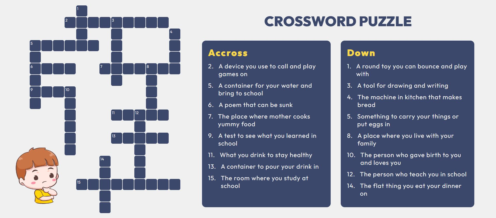

# Crossword Puzzle Game

## Game Description

The English Learning Crossword Puzzle Game is a fun and educational game designed to help children learn and reinforce their English language skills. This game introduces vocabulary, spelling, and word recognition in an interactive and engaging way.

## Key Features

- Kid-Friendly Interface: The game provides a user-friendly and kit-appropriate interface for easy navigation and interaction.
- Vocabulary Building: Players can expand their English vocabulary while having fun.
- Hints and Clues: The game includes hints and clues to assist players to fill the blank box

## How to Play

1. Fill in the crossword grid with words related to the given number and clues.
2. Complete the crossword puzzle and have fun.

## Where to Play

Play the game online by accessing the [GitHub page](https://azalyarahmatika.github.io/crossword-puzzle-game/).

## System Requirements

- Modern web browsers such as Google Chrome, Mozilla Firefox, or Safari.

Thank you for playing the Crossword Puzzle Game! Have fun while enhancing your English language skills.